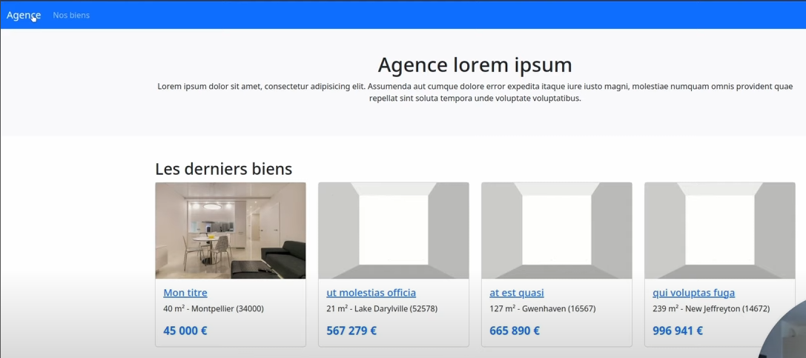
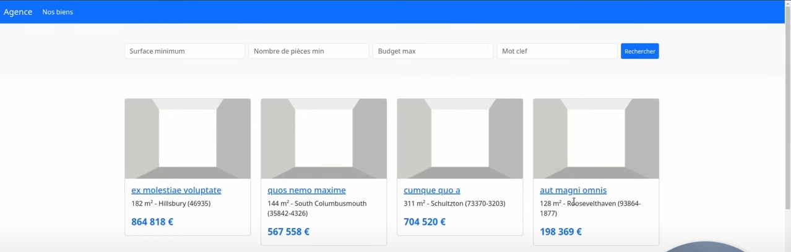
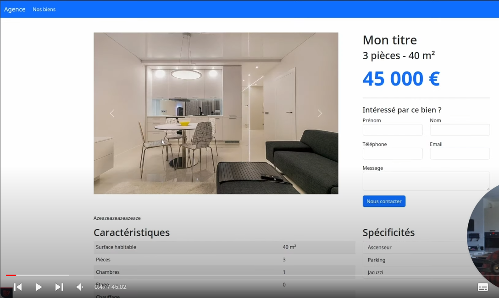
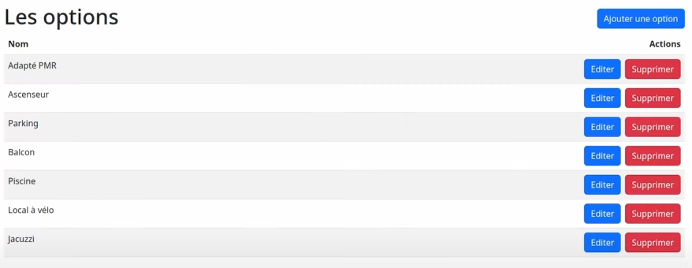
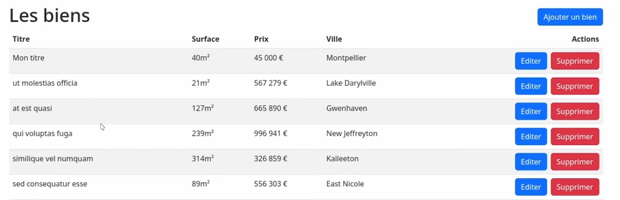
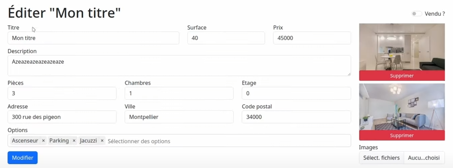

# Liste des tâches a effectué pour le TP Agence Immobilière

-------------------------------------AgenceImmoController-------------------------------------

* Ajout d'une navbar
    * Avec un logo
    * lien pour visualiser tous les biens

* Créer une page d'accueil
    * Un titre avec une description
    * liste des derniers biens ajoutés 

* Faire une page qui liste les biens paginés
    * Avec différents filtres (Surface min, nombre de pièces min, prix max, mot clef)*

* Faire une page qui affiche les détaille d'une maison

-------------------------------------AdminController et AuthController-------------------------------------

* Faire une partie admin (Auth)
    * Ajout et suppr de caractéristiques
    * Gestion des biens immobiliers
        * Page d'édition
        * Suppression 

* Les tables : biens(titre, surface, prix, description, pièces, chambres, etage, adresse, ville, code postal, options), options()